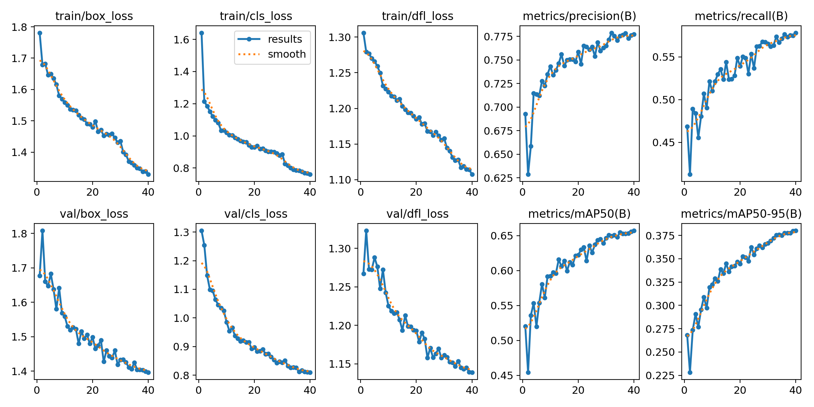

# Object Detecting (YOLOv8, 2-class: head/person)

사람 및 머리(head) 탐지를 위한 YOLOv8 파인튜닝 프로젝트입니다.  
Roboflow Universe의 데이터셋 3,000장을 사용해 Colab에서 학습했고, 최종 가중치 **`weights/best.pt`** 로 추론합니다.



> 위 이미지는 학습 결과(`results.png`)를 그대로 표시한 것입니다.

---

## 📦 Dataset

- 출처: Roboflow Universe – **human-wg4jz**  
  <https://universe.roboflow.com/human-urngn/human-wg4jz>
- 사용 수량: 총 **3,000장**
- 전처리: `fit (black edges) in` 640×640 (letterbox에 해당)
- 분할 비율: **Train 2,400 / Valid 300 / Test 300** (80/10/10)
- 클래스: `0=head`, `1=person`
- 라이선스: **CC BY 4.0** (데이터셋 문서/README 참고)

```
object-detecting/
├─ data/
│  ├─ image1.jpg
│  ├─ image2.jpg
│  └─ image3.jpg
├─ dataset/
│  ├─ data.yaml
│  ├─ README.dataset.txt
│  ├─ README.roboflow.txt
│  ├─ train/ (images, labels)
│  ├─ valid/ (images, labels)
│  └─ test/  (images, labels)
├─ src/
│  └─ detecting.py     # 추론 스크립트
├─ weights/
│  └─ best.pt          # 최종 학습 가중치
└─ results.png         # 학습 결과 곡선/지표
```

---

## 🧠 Training (on Google Colab)

- 프레임워크: **Ultralytics YOLOv8**
- 사전학습: `yolov8n.pt` (COCO)
- Epochs: 30 (필요 시 40~50 권장)
- Image size: 640 (작은 객체 많으면 768 권장)
- Batch: 16 (T4 기준)

Colab 핵심 셀 예시:
```python
!pip -q install ultralytics roboflow opencv-python

from roboflow import Roboflow
from ultralytics import YOLO

# Roboflow에서 제공하는 값으로 교체
rf = Roboflow(api_key="YOUR_API_KEY")
project = rf.workspace("human-urngn").project("human-wg4jz")
dataset = project.version(1).download("yolov8")

model = YOLO("yolov8n.pt")
model.train(
    data=f"{dataset.location}/data.yaml",
    epochs=30, imgsz=640, batch=16, device=0,
    project="runs_own", name="y8n_3k"
)
# 학습 결과: runs_own/y8n_3k/weights/best.pt
```

---

## ⚙️ Requirements

로컬(VSCode)에서 추론만 실행하는 최소 패키지:

```bash
pip install -U pip wheel setuptools
pip install ultralytics opencv-python
# (윈도우에서 NumPy 충돌 시)
# pip uninstall -y numpy matplotlib
# pip install numpy==1.26.4 matplotlib==3.7.5
```

---

## ▶️ Inference (VSCode / Python)

`src/detecting.py`는 OpenCV로 결과를 **바로 화면에 표시**하고, `S` 키로 저장할 수 있는 미니 스크립트입니다.

```bash
# 프로젝트 루트에서
python src/detecting.py
```

기본 동작:
- 가중치: `weights/best.pt`
- 이미지: `data/image1.jpg`, `data/image2.jpg`, `data/image3.jpg`
- 창 조작: **아무 키 → 다음 이미지**, **S → 저장**, **Q/ESC → 종료**
- 저장 경로: `runs_pred/` 하위

`src/detecting.py` (요약형) 예시:
```python
from ultralytics import YOLO
from pathlib import Path
import cv2, numpy as np

ROOT = Path(__file__).resolve().parent
WEIGHTS = ROOT / "../weights/best.pt"
IMAGES  = [ROOT/"../data/image1.jpg", ROOT/"../data/image2.jpg", ROOT/"../data/image3.jpg"]

def preprocess(img, gamma=1.0, maxw=1600):
    h, w = img.shape[:2]
    if w > maxw:
        img = cv2.resize(img, (maxw, int(h*maxw/w)), interpolation=cv2.INTER_AREA)
    if gamma != 1.0:
        table = ((np.arange(256)/255.0)**(1.0/gamma)*255).astype(np.uint8)
        img = cv2.LUT(img, table)
    return img

def main():
    model = YOLO(str(WEIGHTS))
    print("[INFO] S=저장, 임의 키=다음, Q/ESC=종료")
    for p in IMAGES:
        img = cv2.imread(str(p)); 
        if img is None: 
            print(f"[WARN] 읽기 실패: {p}"); continue
        pre = preprocess(img, gamma=1.0)
        res = model.predict(source=pre, conf=0.25, iou=0.60, imgsz=640, device="cpu", verbose=False, augment=True)[0]
        vis = res.plot()
        cv2.imshow("YOLOv8", vis)
        k = cv2.waitKey(0) & 0xFF
        if k in (27, ord('q')): break
        if k in (ord('s'),):
            out = ROOT / "../runs_pred" / f"{Path(p).stem}_pred.jpg"
            out.parent.mkdir(parents=True, exist_ok=True)
            cv2.imwrite(str(out), vis)
            print("[SAVED]", out)
    cv2.destroyAllWindows()

if __name__ == "__main__":
    main()
```

> WSL/원격 GUI 환경에선 `cv2.imshow`가 보이지 않을 수 있습니다. Windows 네이티브 파이썬/인터프리터로 실행하세요.

---

## 🔧 Tips (정확도 향상 – 추론/전후처리만)
- `conf`/`iou` 조정: `conf=0.35~0.5`, `iou=0.55~0.65`로 **오검출/중복 감소**
- Test-Time Augmentation: `augment=True` (속도↓, 재현↑)
- 작은 객체 많으면: `imgsz=768`
- 규칙 후처리:
  - `head`는 `person` 박스 내부일 때만 인정(오검출 억제)
  - 최소 면적/종횡비 필터로 노이즈 박스 제거

---

## 📄 Notes & License

- 데이터셋 라이선스: **CC BY 4.0** — 재배포 시 출처 표기 필요
- 본 저장소의 코드/가중치 라이선스는 프로젝트 정책에 맞게 설정하세요(예: MIT)

---

## ✅ Checklist

- [x] `weights/best.pt` 존재  
- [x] `dataset/data.yaml` 경로/클래스 확인 (`head`, `person`)  
- [x] `results.png`가 루트에 위치 (README에 표시됨)  
- [x] `python src/detecting.py` 로 추론 확인
